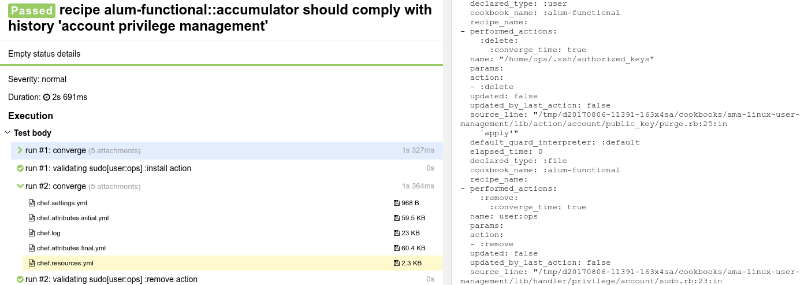

# Draft warning

This project is nothing but idea at current time. It doesn't work, it
doesn't exist yet, you never were here :(

# Test Ketchup

Ketchup is a plain simple framework to simplify [ChefSpec][] and 
[Test Kitchen][] + [InSpec][] management.

If you've used those tools, you already know that everything boils
down to simple pipeline*:

- Setup Chef runner with attributes and data bags
- Run specific recipes and/or roles
- Make specific assertions about the success, runner state and
node state.

<sup><sub>* when using Test Kitchen with Chef</sub></sup>

This sounds quite... *declarative*. Why couldn't one describe his tests
like that?

```yaml
name: A series of runs
runner:
  platform: ubuntu
  version: 16.04
  step_into:
    - 'cookbook::recipe'
defaults:
  attribute_path: $
  run_list:
    - 'cookbook::recipe'
runs:
  - attributes:
      normal:
        alpha: beta
        install: please not
        usure: yes i am
    data_bags:
      users:
        mildred:
         password: i believe you have my stahpler
    # override that default value to be a badly verbose boy
    run_list:
      - 'cookbook::recipe'
    chefspec:
      recipes:
        'cookbook:recipe': true
        'bookcook:ceripe': false
      resources:
        template:
          # i assert you do not even touch that template
          /etc/funny-motd: false
          # i assert you did something unclear
          /etc/bazinga: true
          # i assert you created that template
          /etc/bingo: create
          # i assert you do not create that template, expressive
          /etc/bingoers:
            inverse: true
            actions: [create]
            properties:
              mode: '0666'
          # i assert you created that template at compile phase
          # and notified poor papache and subscribed on that
          # webserver videoblogger
          /etc/bingo.d/bongo:
            actions: [create]
            phase: compile
            notifies:
              service[papache2]:
                restart: immediately
            subscribes:
              service[xginn]:
                stop: delayed
    inspec:
      file:
        /etc/bingoers:
          it:
            - not exist
            - not be_pipe
            - not be_linked_to /etc/target
          size:
            - ['not', eq, 666]
```

This is:
- Much more clear than setting the same things in code
- Provides easy framework for multiple sequential converges
- Allows using YAML anchors to reduce data amount

So far so good, but imagine something has failed. How does one find 
the failure? The good news are that Ketchup provides integration with
[Allure Framework][] when it is present. It will automatically
attach node state (= attributes), chef log, resource collection,
settings and input data to test report, as well as split generated 
tests into steps:



Isn't that awesome?

  [allure framework]: https://github.com/allure-framework/
  [inspec]: https://inspec.io
  [chefspec]: https://github.com/chefspec/chefspec
  [test kitchen]: http://kitchen.ci
